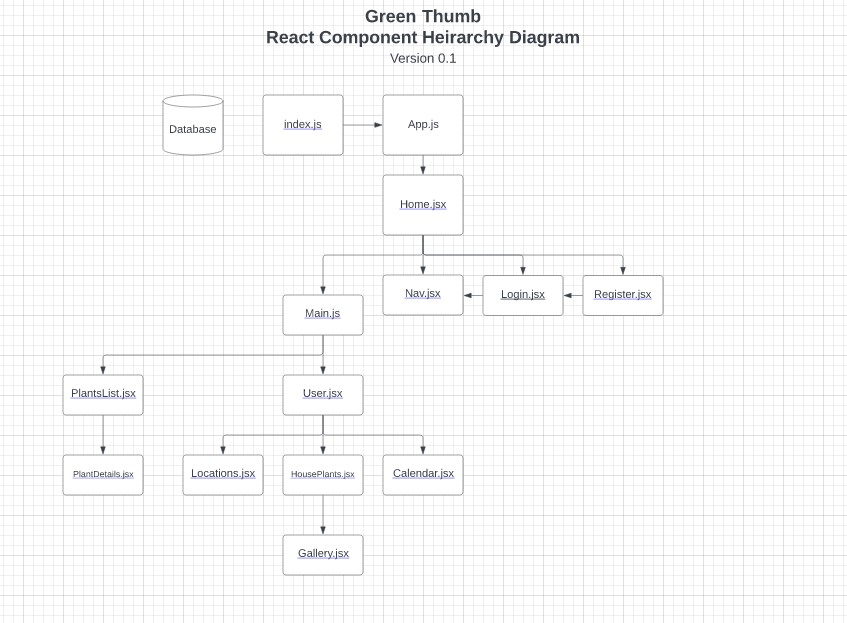
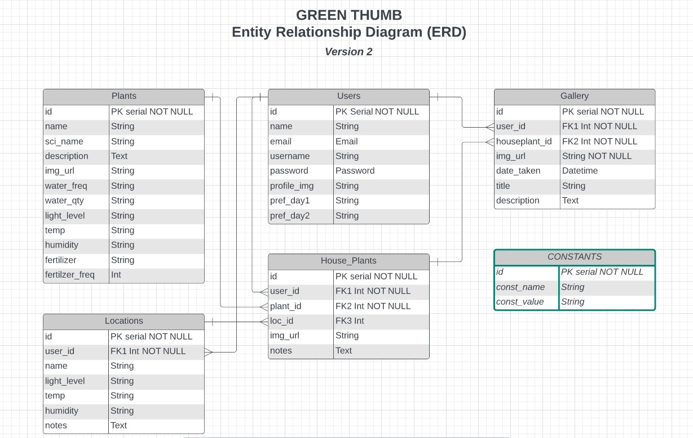

# Green Thumb

   

## A mobile-first application to help keep your houseplants happy and healthy!
### Created by Tim Ellis
#### *for the General Assembly SEI Capstone Project*

[LinkedIn](https://www.linkedin.com/in/tim-m-ellis/)
|
[GitHub](https://github.com/timmellis/)

---

*Bonus: This project also produced an incidental but quite valuable secondary deliverable -- a tutorial on installing and configuring SimpleJWT Authorization for a DjangoREST + React application, which can be found [**here**](https://docs.google.com/document/d/1qG6dYfw0yUBiGbNZZabw1XXLWirqp_TyK9W42T1y_kY/).*

---

## **Summary**
House plants come in all shapes and sizes. Some are hearty and uncomplaining, while others are tempermental and start to wither when even the slightest thing goes out of balance. But plants owners will tell you that keeping track of watering schedules, light levels, temperatures, humidity preferences, and more can be a helluva chore. 

That's where Green Thumb comes in! Green Thumb will keep track of the basic care information for each plant in your collection, suggest the best location in your home based on light levels, and even give you reminders for watering and feeding schedules for your leafy friends. 

---
## **The Project**
This web application was developed as the capstone project for the General Assembly SEI Program in May, 2022. The project requirements were to develop a full-stack appliation with full CRUD capabilities using any of the front- and back-end technologies we had learned over the 12-week intensive course. I opted to utilize a Python/Django backend (the newest and least familiar structure we had learned), paired with a front-end built in React.js.

## Functionality
The primary functionality centers around a user's ability to set up their home's "Locations", add plants to their "Houseplants" collection, and setting a few simple preferences. The application will then display organized information about each plant and location. It will also create an auto-generated calendar based on matching their plants' needs with their preferences, which can be viewed in "Month" or "List" mode. 

Unlike the user-specific database information like personal houseplants and locations within the home, the Plants stored in the database are collectively generated by *all* users -- if another user has already entered a given plant's care instructions, the next user does not need to duplicate their work! I find this sort of collective sharing of information to be a wonderful, community-oriented way of generating data.

## **Development and Orgainzation**

## Resources
- [**Green Thumb - Backend Repo**](https://github.com/timmellis/green_thumb_backend)
- [Trello board](https://trello.com/b/RYBDOmfE/green-thumb-ga-p4-project)
- [Entity Relationship Diagram](https://lucid.app/lucidchart/e009c418-5241-43bc-a554-c11586ac1592/edit?invitationId=inv_122b7052-e038-4f9f-bff3-f7e5f98dac9b&page=0_0#)
- [Component Hierarchy Diagram](https://lucid.app/lucidchart/527db07f-dde8-44f2-bf0e-2d530ddcecdd/edit?beaconFlowId=136B999EF37C30D7&invitationId=inv_e7e092dc-a5aa-48ac-b378-953249d6c528&page=0_0#)

## Technologies

**React.js -** 
- https://reactjs.org/

**Json Web Tokens -** 
- https://www.npmjs.com/package/jsonwebtoken

**React-Icons -** 
- https://react-icons.github.io/react-icons/
- https://github.com/react-icons/react-icons

**React-Bootstrap -**
- https://react-bootstrap.github.io/
- https://www.npmjs.com/package/react-bootstrap-icons

**Full Calendar React component library -**
https://fullcalendar.io/docs/react
- @fullcalendar/daygrid
- @fullcalendar/react
- @fullcalendar/rrule
  - https://github.com/jakubroztocil/rrule

**Google Fonts -**
- https://fonts.google.com/specimen/Josefin+Sans

**Logo (sources) -**
- https://www.vectorstock.com/royalty-free-vector/flower-pot-and-plant-logo-vector-21052345
- https://emojipedia.org/emojidex/

## Planning 
### Component Heirarchy
<a href="https://lucid.app/lucidchart/527db07f-dde8-44f2-bf0e-2d530ddcecdd/edit?invitationId=inv_e7e092dc-a5aa-48ac-b378-953249d6c528">*Component Heirarchy*</a>

---
## Backend Development & Database Structure
The database stores a library of information about each Plant and its needs, which is generated collectively by all users. as well as information about the User, the Houseplants they own, the Locations in their home, and their preferences for watering schedules.

<a href="https://lucid.app/lucidchart/e009c418-5241-43bc-a554-c11586ac1592/edit?viewport_loc=-132%2C-376%2C2070%2C1578%2C0_0&invitationId=inv_122b7052-e038-4f9f-bff3-f7e5f98dac9b">*Entity Relationship Diagram*</a>

*Note: The Gallery feature did not ultimately get implemented on this version of the project, but I hope to include it in an updated release later this year.*
## Backend development Resources

### Django, DjangoREST Framework
- https://www.django-rest-framework.org/

### Django CORS Headers
- https://github.com/adamchainz/django-cors-headers

### SimpleJWT Authorization for Django
- https://hackernoon.com/110percent-complete-jwt-authentication-with-django-and-react-2020-iejq34ta
- https://github.com/tverg419/pyploto-backend

- *(As a result of the guidance of the above resources, plus about 12 hours of troubleshooting and debugging, I created the following guide. I hope it's useful for others.)* 
https://docs.google.com/document/d/1qG6dYfw0yUBiGbNZZabw1XXLWirqp_TyK9W42T1y_kY/edit#

---

### Other credits and citations:
- Simple script to check if Image URL exists [(Link)](https://codepen.io/kallil-belmonte/pen/KKKRoyx)
- Set a timeout function to automatically close Bootstrap modal [(Link)](https://stackoverflow.com/questions/62226639/modal-reactjs-close-time)

